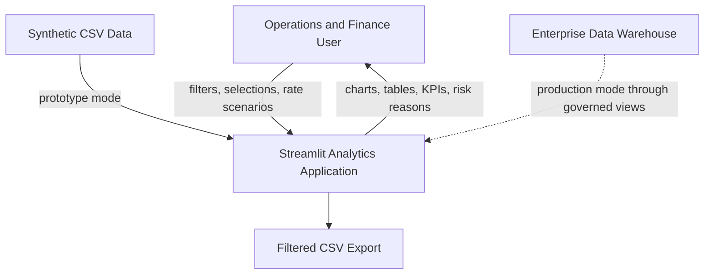
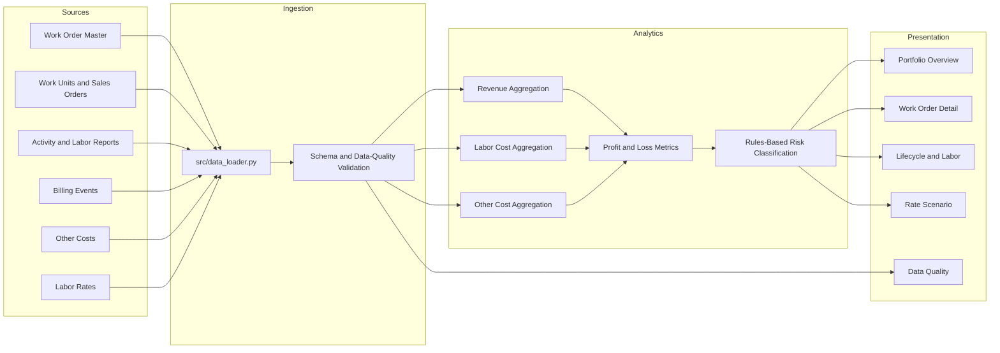
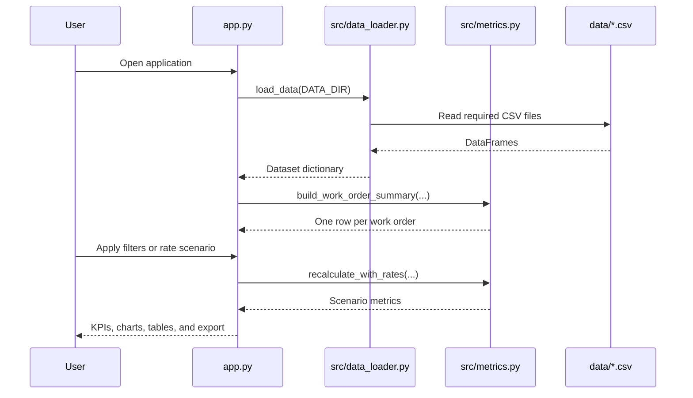
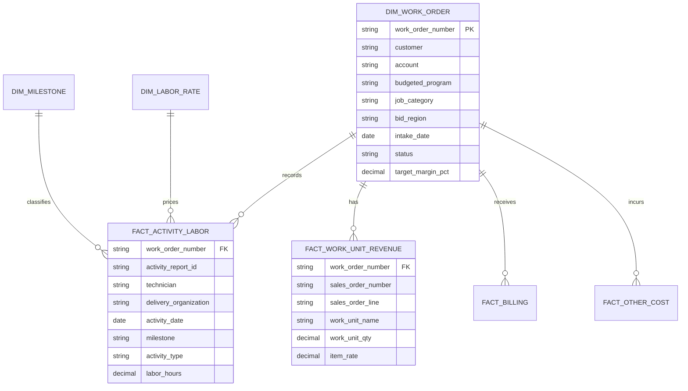

# Architecture

## 1. Purpose

Engineering Work Order Profit and Loss Analytics is a layered analytical application that combines work-order master data, work-unit revenue, labor activity, billing, labor rates, and other costs into a single work-order financial and lifecycle summary.

The public repository runs on synthetic CSV files. The same logical model can be implemented over governed Snowflake views or another analytical warehouse.

## 2. System context

## 3. Logical layers

## 4. Runtime sequence

## 5. Data model

The model follows a small analytical star pattern:

- `dim_work_order` is the central work-order dimension.
- `fact_work_unit_revenue` contains sales-order work-unit lines.
- `fact_activity_labor` contains activity and labor events.
- `fact_billing` contains invoices and progress billing.
- `fact_other_cost` contains non-labor expenses.
- `dim_labor_rate` maps a delivery organization to an effective hourly rate.
- `dim_milestone` standardizes lifecycle order and activity labels.

## 6. Component responsibilities

| Component | Responsibility |
|---|---|
| `app.py` | User interface, filtering, visualization, downloads, and scenario inputs |
| `src/data_loader.py` | Required-file checks, CSV parsing, and date conversion |
| `src/metrics.py` | Revenue, cost, margin, lifecycle, and risk calculations |
| `scripts/generate_synthetic_data.py` | Deterministic generation of synthetic dimensions and facts |
| `sql/*.sql` | Snowflake physical model, analytical views, and quality checks |
| `tests/` | Regression checks for grain, metrics, and scenario behavior |

## 7. Caching and performance

The application uses `st.cache_data` for source frames and the derived work-order summary. This prevents repeated file reads and metric recomputation during normal widget interactions.

For larger datasets:

- Push aggregation into Snowflake.
- Load only required columns and filtered date ranges.
- Materialize the work-order summary view.
- Add warehouse clustering or partitioning on activity date and work-order number.
- Paginate or sample detailed tables in the UI.

## 8. Security architecture

The public mode has no authentication and uses synthetic files. A real deployment should add:

- Identity provider authentication
- Role-based access control
- Row-level or account-level security
- Network restrictions and private connectivity
- Secrets management
- Audit logging
- Data retention and masking policies
- Separate development, test, and production environments

## 9. Production deployment patterns

### Pattern A: Streamlit in Snowflake

Use Snowpark DataFrames or SQL views and grant the application role access only to curated analytical views.

### Pattern B: External Streamlit application

Use a service account, private connectivity, encrypted secrets, and a read-only warehouse role.

### Pattern C: Scheduled extracts

Export governed summary files to controlled object storage and refresh the application on a schedule. This is simpler but less real-time.

## 10. Key architectural decisions

1. **One-row-per-work-order summary:** simplifies dashboard filtering and portfolio KPIs.
2. **Facts remain separate:** preserves auditability and drill-down.
3. **Rates are data, not constants:** supports scenario analysis and effective-date extensions.
4. **Zero-hour events are retained:** they can represent lifecycle transitions even when they have no labor cost.
5. **Risk reasons are explicit:** users can see why a work order was classified as high or medium risk.
6. **Synthetic data is generated in code:** the demonstration is reproducible and safe for public sharing.
