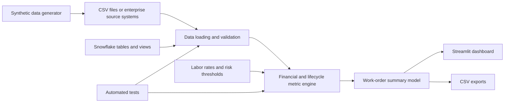

# Engineering Work Order Profit and Loss Analytics

A complete, GitHub-ready analytics project for estimating work-order revenue, tracking labor and operational costs, monitoring billing, calculating profit and loss, and identifying margin risk across the engineering delivery lifecycle.

> **Public-data notice:** This repository uses entirely synthetic data. It does not contain or reproduce confidential company, customer, employee, financial, operational, or production information. All names, identifiers, rates, work-unit codes, dates, and values are fictitious.

## Project overview

Engineering organizations often receive revenue information, labor records, billing events, and non-labor expenses from different systems. This project brings those records into one analytical model and answers questions such as:

- What revenue is currently forecast for each work order?
- How much labor and other cost has accumulated?
- Which work orders are below their target margin?
- Which projects have unusually high travel or rework?
- How would margin change under different labor-rate assumptions?
- Are there duplicate, missing, orphaned, zero-hour, or negative-hour records?

## Key features

- Portfolio-level revenue, cost, profit, margin, billing, and risk indicators
- Work-order drill-down with work units, invoices, other costs, and activity history
- Lifecycle analysis across intake, planning, field operations, design, permitting, delivery, and billing
- Delivery Center versus Field Operations labor analysis
- Travel and rework monitoring
- Configurable labor-rate scenario analysis
- Data-quality checks and downloadable filtered summaries
- Reproducible synthetic-data generator
- Snowflake-ready tables and analytical views
- Automated tests and GitHub Actions continuous integration
- Full documentation and GitHub Wiki content

## Synthetic dataset included

| Dataset | Rows | Grain |
|---|---:|---|
| Work orders | 600 | One row per work order |
| Work-unit revenue | 2,660 | One row per sales-order work-unit line |
| Activity/labor reports | 8,713 | One row per labor or lifecycle event |
| Billing events | 730 | One row per invoice or progress-billing event |
| Other costs | 977 | One row per travel, permit, or subcontractor expense |
| Labor rates | 2 | One row per delivery organization and effective rate |
| Milestone mapping | 16 | One row per milestone/activity mapping |

The bundled dataset spans **January 3, 2025 through May 31, 2026** and is deterministic: regenerating it with the default seed produces the same data.

## Architecture



Detailed diagrams and design decisions are in [ARCHITECTURE.md](ARCHITECTURE.md).

## Repository structure

```text
engineering-workorder-profit-loss-analytics/
├── app.py                         # Streamlit application
├── data/                          # Synthetic CSV datasets
├── src/                           # Data loading and metric calculations
├── scripts/                       # Data generation and Wiki publishing helpers
├── sql/                           # Snowflake schema, views, and quality checks
├── tests/                         # Automated tests
├── docs/                          # Detailed technical documentation
├── wiki/                          # GitHub Wiki-ready Markdown pages
├── .github/                       # CI workflow and contribution templates
├── README.md                      # Main project documentation
├── ARCHITECTURE.md                # System architecture
├── DATA_DICTIONARY.md             # Complete field reference
├── PROJECT_STRUCTURE.md           # Repository organization
└── A-Z_FILE_GUIDE.md              # Alphabetical reference for every file
```

## Quick start

### Requirements

- Python 3.10 or newer
- Internet access during the first dependency installation
- Approximately 100 MB of free disk space

### Windows: one-click setup

Extract the repository and run:

```powershell
.\setup_and_run.ps1
```

Alternatively, double-click:

```text
setup_and_run.bat
```

### Windows: manual setup

```powershell
cd engineering-workorder-profit-loss-analytics
py -m venv .venv
.\.venv\Scripts\Activate.ps1
python -m pip install --upgrade pip
pip install -r requirements.txt
streamlit run app.py
```

### macOS or Linux

```bash
cd engineering-workorder-profit-loss-analytics
python3 -m venv .venv
source .venv/bin/activate
python -m pip install --upgrade pip
pip install -r requirements.txt
streamlit run app.py
```

Open the URL shown by Streamlit, normally `http://localhost:8501`.

## Dashboard pages

### Portfolio Overview

Shows portfolio totals, risk distribution, regional revenue/cost/margin, program-level margin, and a downloadable work-order financial summary.

### Work Order Detail

Provides work-unit revenue, billing events, other costs, activity timeline, lifecycle notes, total hours, margin, and risk reason for one selected work order.

### Lifecycle & Labor

Compares hours across milestones and delivery organizations and summarizes the most time-consuming activity types.

### Rate Scenario

Allows users to modify Delivery Center and Field Operations burdened rates and observe how cost, margin, and at-risk work-order counts change.

### Data Quality

Checks potential duplicate work-unit rows, orphan activity records, zero-hour lifecycle events, negative hours, and work orders without revenue lines.

## Core financial calculations

```text
Estimated Revenue = Σ(Work Unit Quantity × Item Rate)
Labor Cost = Σ(Activity Hours × Applicable Hourly Rate)
Actual Cost = Labor Cost + Other Cost
Forecast Revenue = MAX(Estimated Revenue, Billed Revenue)
Forecast Margin = Forecast Revenue − Actual Cost
Forecast Margin % = Forecast Margin ÷ Forecast Revenue
Margin Variance % = Forecast Margin % − Target Margin %
```

Risk bands also consider rework and travel:

- **High:** margin below the high-risk threshold, rework of at least 6 hours, or travel of at least 8 hours
- **Medium:** margin below the medium-risk threshold, rework of at least 3 hours, or travel of at least 5 hours
- **Low:** none of the configured risk conditions are met

See [financial-calculations.md](financial-calculations.md) for definitions and examples.

## Regenerate the synthetic data

```bash
python scripts/generate_synthetic_data.py --output data --work-orders 600
```

Generate a smaller demonstration dataset:

```bash
python scripts/generate_synthetic_data.py --output data --work-orders 100
```

## Run tests

```bash
pytest -q
```

Additional validation:

```bash
python -m compileall app.py src scripts tests
```

## Snowflake integration

The `sql/` directory contains:

- `snowflake_schema.sql` — physical table definitions
- `profit_loss_views.sql` — reusable revenue, labor, and profit-and-loss views
- `quality_checks.sql` — SQL checks for duplicates, orphan records, invalid values, and missing rates

A production implementation should map enterprise source fields to the documented logical model rather than uploading confidential data to this public repository. See [docs/snowflake-integration.md](snowflake-integration.md).

## Documentation and Wiki

Start with:

- [Architecture](ARCHITECTURE.md)
- [Data Dictionary](DATA_DICTIONARY.md)
- [Project Structure](PROJECT_STRUCTURE.md)
- [GitHub Repository Setup](GITHUB_REPOSITORY_SETUP.md)
- [A–Z File Guide](A-Z_FILE_GUIDE.md)
- [Installation](installation.md)
- [User Guide](user-guide.md)
- [Developer Guide](developer-guide.md)
- [GitHub Wiki Home](https://github.com/dranubhaparashar/Engineering-Work-Order-Profit-and-Loss-Analytics/wiki)

## Limitations

- Financial logic is a demonstration and is not an accounting standard or audited financial model.
- Revenue recognition, burdened labor rates, overhead allocation, tax, currency conversion, and cost capitalization vary by organization.
- The risk model is rules-based rather than predictive.
- CSV loading is suitable for a prototype; production deployments should use governed warehouse views and access controls.
- Synthetic patterns are designed for demonstration and should not be interpreted as industry benchmarks.

## Responsible public use

Before connecting the project to real systems:

1. Obtain written authorization from the data owner.
2. Keep credentials outside the repository.
3. Use role-based access control and least privilege.
4. Remove or mask personal, customer, location, pricing, and contract information.
5. Validate financial definitions with finance and operations stakeholders.
6. Review repository history before making it public.

## Contributing

Read [CONTRIBUTING.md](CONTRIBUTING.md) before opening an issue or pull request. Please report security concerns according to [SECURITY.md](SECURITY.md).

