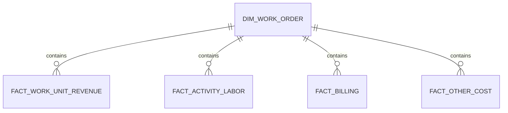

# Data Model

## Model objective

The model supports both portfolio aggregation and transaction-level drill-down while preserving the original grain of each synthetic source.

## Central key

`work_order_number` joins the work-order dimension to revenue, labor, billing, and other-cost facts.

## Cardinality

A sales order is not assumed to be one-to-one with a work order. Multiple sales orders and multiple work-unit lines are supported.

## Fact-table grains

| Fact | Grain | Main measure |
|---|---|---|
| Work-unit revenue | Sales-order line | Quantity, rate, line total |
| Activity/labor | Activity report | Hours |
| Billing | Billing event | Billed amount |
| Other costs | Expense event | Amount |

## Slowly changing rates

The sample contains one effective rate per delivery organization. Production logic should select the latest rate effective on or before each activity date, or use explicit start/end dates.

## Summary model

`build_work_order_summary` produces one derived row per work order. This row is optimized for dashboard use and should be treated as a derived analytical mart, not as a replacement for detailed facts.

See `DATA_DICTIONARY.md` for every field.
